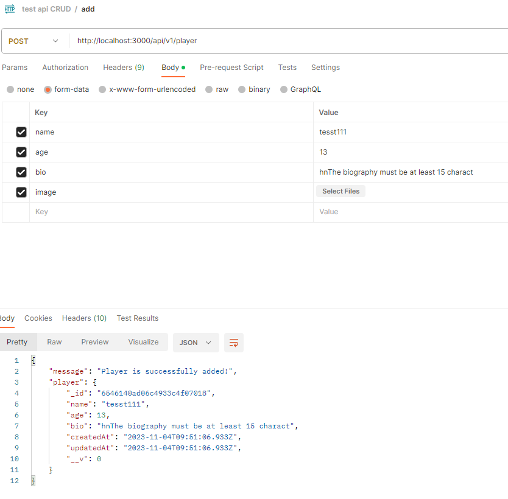
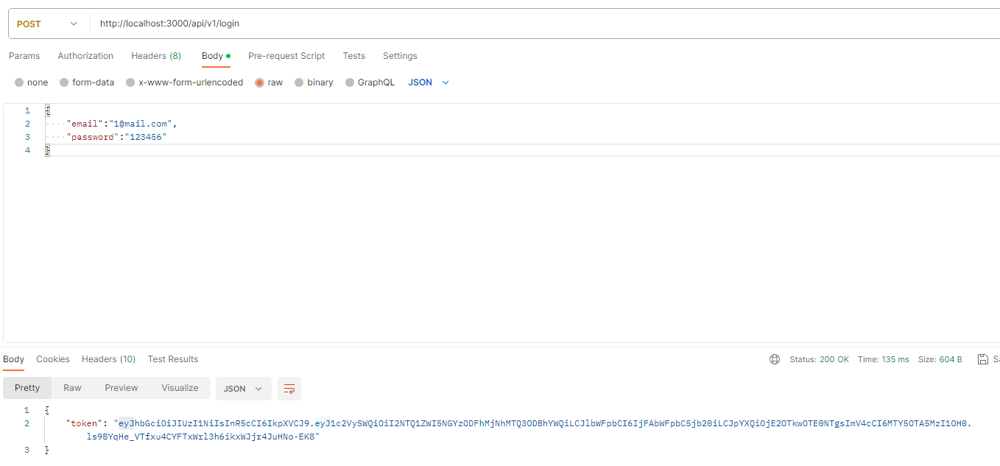

# nodejs-crud-api
Node.js, Express and MongodB: Create a Restfull API with images upload

## What will you learn ?
What will you learn by downloading my code?
- Use of **express** to make API creation simple
- Using **mongoose** to manage communication with Mongo DB
- Image Upload with **multer**
- Image deletion with the notions of paths and file system in node
- Field validation using **express-validator**
- Creation of reusable methods thanks to the concept of **modules**
- Creation of a functional REST API with Node.js, Express and Mongo DB.

Are you ready ? Let's go

## Step 1: Installing dependencies

Clone the repository then run **npm install**

## Step 2: Link your api to Mongo DB

You can install mongodb locally or use Mongo Atlas (online). In both cases, go to the **app.js** file then replace the url **mongodb://localhost:27017/player-db** with your url. In my case I use Mongo DB locally. It is therefore available on port **27017**(by default) and the name of my database is **player-db**.

## Step 3: Launch your project

To launch your project, just type the following command : **node app.js**. Your API will therefore run on port 3000

## Step 4: Test the API endpoints

This is an API that manages players (football for example). A player is characterized by:
* name: the name of the player
* age: the player's age
* bio: a brief biography of the player (at least 15 characters)
* photoUrl: player photo
* createdAt and updatedAt are generated automatically using the **timestamps: true** statement in the **models/index.js file**

So we have a total of 5 routes

1. Add player http://localhost:3000/api/v1/player
2. List of all players http://localhost:3000/api/v1/players
3. Find player by Id http://localhost:3000/api/v1/player/:playerId
4. Update player http://localhost:3000/api/v1/player/:playerId
5. Delete player http://localhost:3000/api/v1/player/:playerId
6. Login http://localhost:3000/api/v1/login
7. Register http://localhost:3000/api/v1/register
8. Export excel http://localhost:3000/api/v1/export-to-excel

## Some precisions

